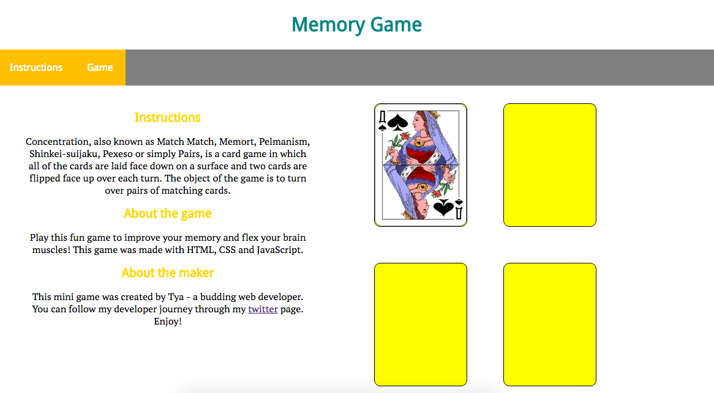
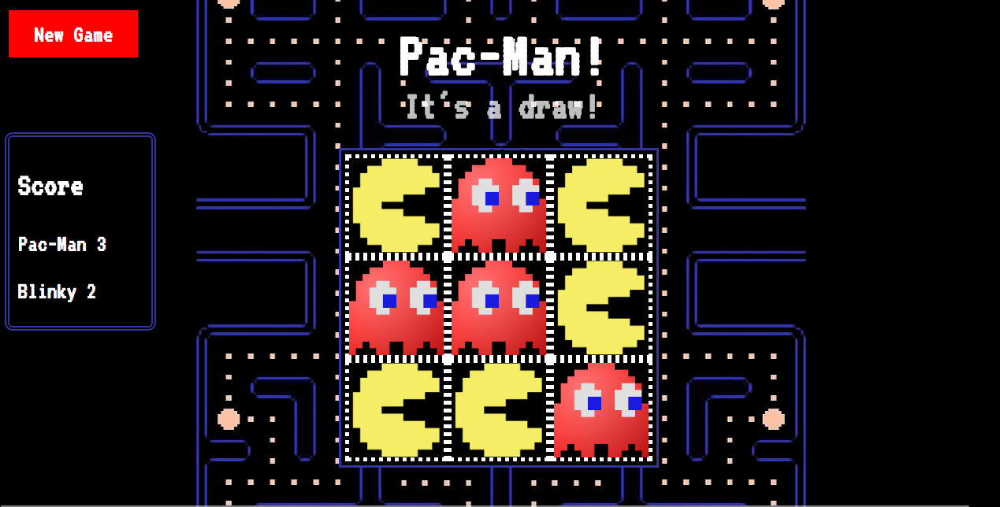
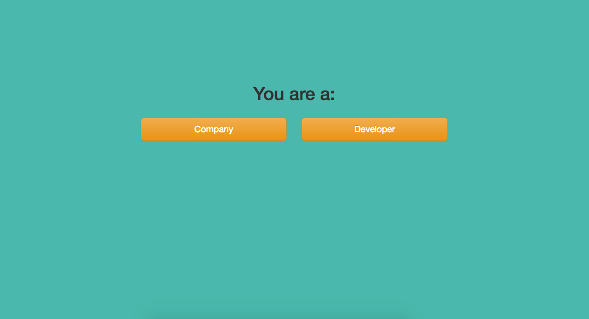
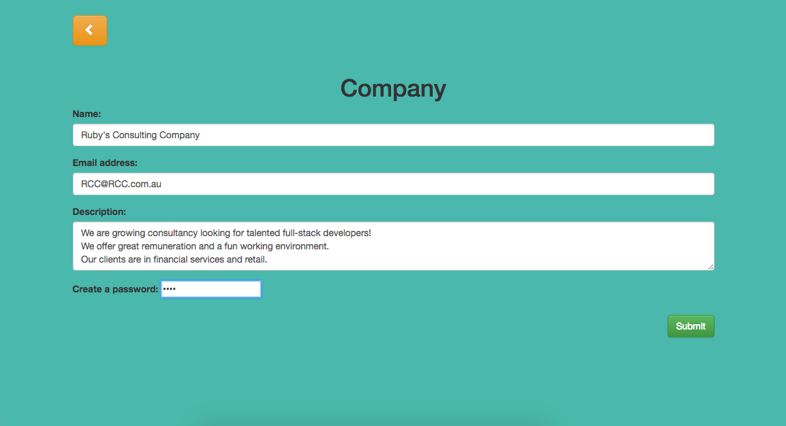
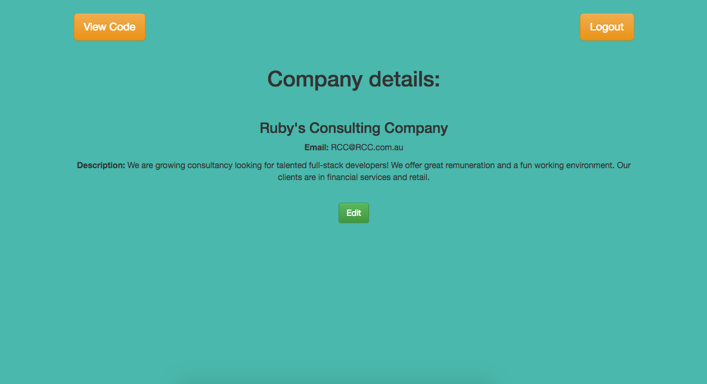
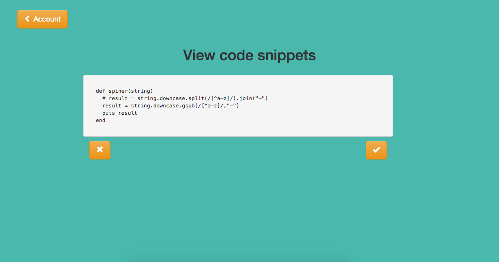
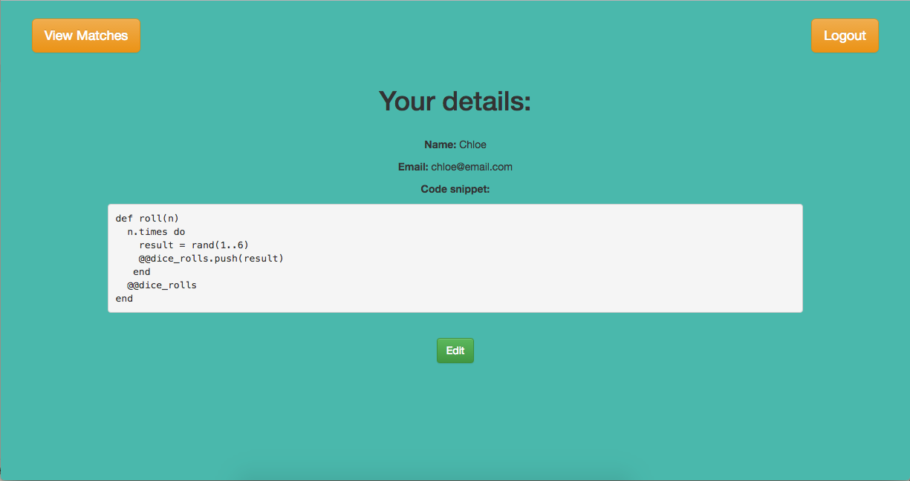
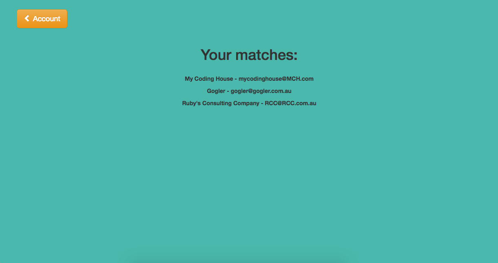

# First six weeks of life as a web developer

I have recently completed the first six weeks of my 12 week web development course at General Assembly. I thought it would be a good opportunity for me to reflect on my experiences to date!

I've always had an interest in design, which led me to attending user experience meetups. Eventually, this led me to attend meetups and workshops closely related to web development.

I attended a Ruby workshop hosted by Women Who Code at REA Group. This was my first real exposure to coding. I also applied for the DevelopHER program at MYOB. As part of the application process, MYOB was kind enough to show the applicants around the new Richmond office and learn about how software is built. It was great to see the workings of a technology company and how teams work together.

## Pre-work

In the lead up to the first day of the WDI course, I completed the pre-work which covered HTML, CSS, JavaScript and basic programming concepts such as conditionals, loops and data types. At the end of the units I created my first game which was a simple interactive matching cards game created with HTML, CSS and JavaScript.

## Week 1 (Web Fundamentals)

On the first day of the course, we went through concepts about the web, the HTTP request and response cycle, servers and clients, viewing HTML, CSS and the DOM. Before diving straight into the topics the instructors told us that we will feel many low points throughout the course (and career as a developer) but to remember not to give up and push through. We also decided on a class name, "200-OK" and class rules. Being a graphic designer, I created the class poster and logo.

The first week was solely focussed on JavaScript programming concepts including:
- data types, variables
- data structures (arrays, objects)
- functions
- concepts and principles (e.g. [DRY](https://en.wikipedia.org/wiki/Don't_repeat_yourself))
- DOM manipulation and events

Every morning, we are given a 'warm-up' which usually involves writing a function that solves a problem. Some of my favourite warm-ups so far have been:
- "Decode this Message" (Decode secret message with a simple cipher)
- "Lunch Order" (Create a list of a customer's lunch orders)
- "Say in Hex" (Translate hex code to English - inspired by the TV show Silicon Valley e.g 0xF5 is pronounced "fleventy-five").

I haven't always been able to solve the warm-ups (which can be disappointing) but each time I've discovered new ways of approaching a problem!

It was a huge first week!! We covered so many new topics and my brain was working overtime! I felt exhausted after each day but found renewed energy and enthusiasm.

## Week 2 (Front End Development)

The second week of the course was about applying the technical concepts learnt in the first week and building a program. I've been able to build some JavaScript apps that I couldn't imagine building a week ago! For instance:
- a mock ATM application
- calculator for simple arithmetic
- To-do list

We also went through more CSS, introduced data types such as floats and JavaScript debugging techniques (hooray for breakpoints!).

## Week 3 (Tic-Tac-Toe)

Every third week of the course is dedicated to project week. In any project week, we work on a project for five days and we present on Friday. The first project of the course was to build a simple game using JavaScript. I decided to build [Tic-Tac-Toe](https://ttcao.github.io/tic-tac-toe-game/tic-tac-toe.html). The most challenging part for me was starting!!

There was a lot of (blood, sweat and) tears but I am very happy with the end result. I hope to improve it some day so that the game can scale to bigger game boards!

## Week 4 (Ruby Fundamentals)

Finally to back-end development! At this point I was still trying to connect the dots of how web applications work. I had been studying front-end development up til now and I was excited to learn to build a full-stack application. After a couple of days of Ruby, I found that the programming concepts that I previously learned carried over. I also discovered that Ruby is more elegant and simpler than JavaScript. At this point I moved from using `for` loops to Ruby methods such as `map`, `filter` and `reduce` when working with arrays. I found this approach easier to reason with.

One of the warm-ups I enjoyed solving was "Scrabble Score" - which was to write a Ruby program that computes the scrabble score for a given word.

## Week 5 (Ruby Sinatra)

In the fifth week, I learnt how to use Postgres to build databases for a server-side application. I soon discovered the power of the Sinatra framework, which is used to build back-end services in Ruby.

## Week 6 (Codr: Tinder for Developers)

The brief for the second project of the course was to build a full-stack application with Ruby using Sinatra.

I decided to create an application called "Codr" which connects tech companies with developers. Developers sign up and submit their own code snippets. On the other hand, companies sign up and are then able to 'swipe' through the submitted code snippets, which have been anonymised. Developers are able to contact companies that have 'matched' with them. Instead of companies having control over what code they want candidates to submit, Codr gives developers the freedom to showcase their coding skills however they choose. The anonymity eliminates hiring bias.

I have deployed [Codr](https://codr-app.herokuapp.com) online to Heroku. Feel free to sign up and play around with the app.

#### Codr Home page

#### Company sign up

#### Company profile

#### Company view code snippets

#### Developer profile

#### Developer view matches

